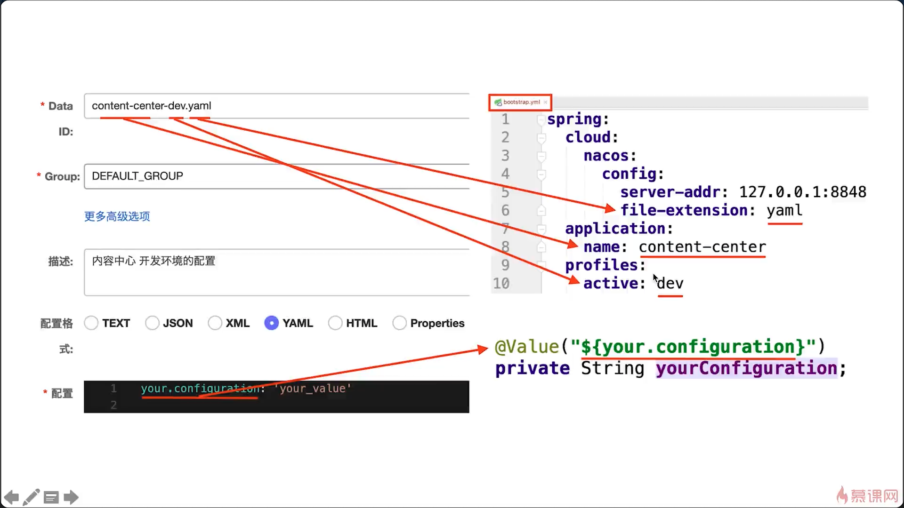

# spring cloud alibaba

### actuator监控
### nacos服务注册与发现
```
sh startup.sh -m standalone
nacos的领域模型和元数据
```
### Ribbon实现负载均衡
```
#用户中心负载均衡策略
#user-center:
#  ribbon:
#    NFLoadBalancerRuleClassName: IRule实现类
#    NFLoadBalancerPingClassName: IPing实现类
#    NFLoadBalancerClassName: ILoadBalancer实现类
#    NIWSServerListClassName: ServerList实现类
#    NIWSServerListFilterClassName: ServerListFilter实现类

代码配置和配置文件配置，注意父子上下文
饥饿加载机制
自定义负载均衡策略支持nacos的权重，同集群和基于元数据的版本控制
```
### 声明式HTTP客户端Feign

* Feign组成

|接口|作用|默认值|
|:---:|:---:|:---:|
|Feign.Build|Feign的入口|Feign.Builder|
|Client|Feign底层用什么去请求|和Ribbon配合时：LoadBalancerFeignClient 
| | | 不和Ribbon配合时：feign.Client.Default|
|Contract|契约，注解支持|SpringmvcContract|
|Encoder|编码器，用于将对象转换成HTTP请求消息体|SpringEncoder|
|Decoder|解码器，将响应消息体转换成对象|ResponseEntityDecoder|
|Logger|日志管理器|Slf4jLogger|
|RequestInterceptor|用于为每个请求添加通用逻辑|无|

* Feign的日志级别

|级别|打印内容|
|:---:|:---:|
|NONE(默认值)|不打印任何日志|
|BASIC|仅记录请求方法、URL、响应状态码以及执行时间|
|HEADERS|记录BASIC级别的基础上，记录请求和响应的header|
|FULL|记录请求和响应的header，body和元数据|

* Feign支持的代码配置项

|配置项|作用|
|:---:|:---:|
|Logger.Level|指定日志级别|
|Retryer|指定重试策略|
|ErrorDecoder|指定错误编码器|
|Request.Options|超时时间|
|Collection<RequestInterceptor>|拦截器|
|SetterFactory|用于设置Hystrix的配置属性,Feign整合Hystrix才会用|

* Feign支持的文件配置项
```
feign.client.config:
    <feignName>:
        connectTimeout: 5000 #连接超时间
        readTimeOut: 5000 #读取超时时间
        loggerLevel: full #日志级别
        errorDecoder: com.example.SimpleErrorDecoder #错误解码器
        retryer: com.example.SimpleRetryer  #重试celve
        requestInterceptors:
            - com.exapmleFooRequestInterceptor  #拦截器
        # 是否对404错误码解码
        # 处理逻辑详见feign.SynchronousMethodHandler#executeAndDecode
        decode404: false
        encoder: com.example.SimpleEncoder  #编码器
        decoder: com.example.SimpleDecoder  #解码器
        contract: com.example.SimpleContract #契约
```
* [Feign常见问题总结](https://www.imooc.com/article/289005)

### sentinel流控和容错
* [sentinel代码配置](https://www.imooc.com/article/289345)

* 应用端连接控制台配置项
```
spring.cloud.sentinel.transport:
    #指定控制台的地址
    dashboard:localhost:8080
    #指定和控制台通信的IP
    #如果不配置，会自动选择一个IP注册
    client-ip:127.0.0.1
    #指定和控制台通信的端口，默认8719
    #如果不设置，会自动从8719开始扫描，依次+1，直到找到未被占用的端口
    port:8719
    #心跳发送周期，默认值null
    #但在SimpleHttpHeartbeatSender会用默认值10秒
    heartbeat-interval-ms:10000
```
* 控制台的配置项

|配置项|默认值|最小值|描述|
|:---:|:---:|:---:|:---:|
|sentinel.dashboard.app.hideAppNoMachineMillis|0|60000|是否隐藏无健康节点的应用，距离最近一次主机心跳时间的毫秒数，默认关闭|
|sentinel.dashboard.removeAppNoMachinesMillis|0|120000|是否自动删除无健康节点的应用，距离最近一次其下节点的心跳时间毫秒数，默认关闭|
|sentinel.dashboard.unhealthyMachineMillis|60000|30000|主机失联判定，不可关闭|
|sentinel.dashboard.autoRemoveMachineMillis|0|300000|距离最近心跳时间超过指定时间是否自动删除失联节点，默认关闭|
|server.port|8080|-|指定端口|
|csp.sentinel.dashboard.server|localhost:8080|-|指定地址|
|project.name|-|-|指定程序的名称|
|sentinel.dashboard.auth.username|sentinel|-|Dashboard登录账号|
|sentinel.dashboard.auth.password|sentinel|-|Dashboard登录密码|
|server.servlet.session.timeout|30分钟|-|登录session过期时间，配置7200为7200秒，60m为60分钟|
* [sentinel持久化拉模式](https://www.imooc.com/article/289402)
* [sentinel持久化推模式](https://www.imooc.com/article/289464)
* [sentinel配置项总结](https://www.imooc.com/article/289562)

### 消息驱动的微服务
* [MQ的选择](https://www.imooc.com/article/290040)
* [RocketMQ安装教程](https://www.imooc.com/article/290089)
* [消息过滤](https://www.imooc.com/article/290424)
* [异常处理](https://www.imooc.com/article/290435) 
* [本章总结](https://www.imooc.com/article/290489) 

### SpringCloudGateway
* [第二代网关Gateway和第一代网关Zuul 1.6倍的性能提升](https://www.imooc.com/article/285068)
* [路由谓词工厂](https://www.imooc.com/article/290804)
* [内置过滤器工厂详解](https://www.imooc.com/article/290816)
* [全局过滤器](https://www.imooc.com/article/290821)
* [Gateway监控](https://www.imooc.com/article/290822)
* [排错调试](https://www.imooc.com/article/290824)
* [gateway限流](https://www.imooc.com/article/290828)

### 认证和授权
* [处处安全方案](https://cnblogs.com/cjsblog/p/10548022.html)
* [JWT操作工具类](https://www.imooc.com/article/290892)
* [自定义注解](https://cnblogs.com/CatsBlog/9329785.html)

### nacos配置中心
* 
* 使用nacos实现配置属性动态刷新与回滚（回滚在该版本具有一点小问题，不能回滚到最初的版本）
* 全局配置和环境配置，多个微服务共享同一个配置
* 优先级 shared-dataids < ext-config < 自动
```
spring:
    cloud:
        config:
            #是否允许本地配置覆盖远程配置
            allow-overridw: true
            # 是否一切以本地哦配置为准，默认false
            override-none: false
            # 系统环境变量或系统属性才能覆盖远程配置文件的配置
            # 本地配置文件中配置优先级低于远程配置，默认false
            override-system-properties: true
```
* [搭建生产可用的nacos集群](https://www.imooc.com/article/288153)

### 调用链路监控
* [zipkin下载和搭建](https://www.imooc.com/article/291572)
* [解决整合zipkin之后nacos报错](https://www.imooc.com/article/291578)

### 代码优化
* statistic插件
* [阿里巴巴代码规范](https://www.github.com/alibaba/p3c)
* [SonarQube](https://www.imooc.com/article/291857)

### 微服务监控
* [springbootadmin](https://github.com/codecentric/spring-boot-admin)
* jconsole & jvisualvm
* 将GC详情打印到gc.log中 -Xmx5m -XX:+PrintGCDetails -Xloggc:gc.log
* [在线gc日志分析日志GCEasy](https://gceasy.io)
* [线程Dump日志](https://fastthread.io)
* [堆Dump日志](https://heaphero.io)
* [使用ELK收集分析日志](https://www.imooc.com/article/291751)

### 异构微服务
* spring cloud微服务和异构微服务之间完美调用
* [spring cloud wii整合异构微服务](https://github.com/eacdy/spring-cloud-wii/tree/0.9.0)
